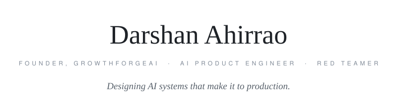

<picture>
  <source media="(prefers-color-scheme: dark)" srcset="assets/hero-dark.svg">
  
</picture>

 

## The short version

I run **[GrowthForgeAI](https://growthforgeai.com)**, an AI studio that ships production agents and automation for real businesses. I architect the systems, a team of AI agents writes the code, and clients get working software in days, not decks in months.

Top Rated on Upwork. 100% Job Success. And when I'm not building models into products, I'm red teaming them for top AI labs.

 

## Currently

**[Sutra](https://joinsutra.com)** 
The AI content team for agencies. It remembers every brand, writes in their voice, and ships nothing without your approval. Content that runs itself.

**[GrowthForgeAI](https://growthforgeai.com)** 
My AI studio. Production agents and automation for businesses that want an edge.

**A shared brain for my agents** 
Three AI agents, one persistent memory. They remember everything, coordinate with each other, and build while I direct.

**Red teaming frontier models** 
Finding the cracks in top AI labs' models before the wrong people do.

 

## Reach me

[darshan@growthforgeai.com](mailto:darshan@growthforgeai.com) · [LinkedIn](https://linkedin.com/in/darshan-ahirrao) · [Upwork](https://www.upwork.com/freelancers/darshanahirrao) · [Instagram](https://instagram.com/02darsh)

 
 

Pune, India

